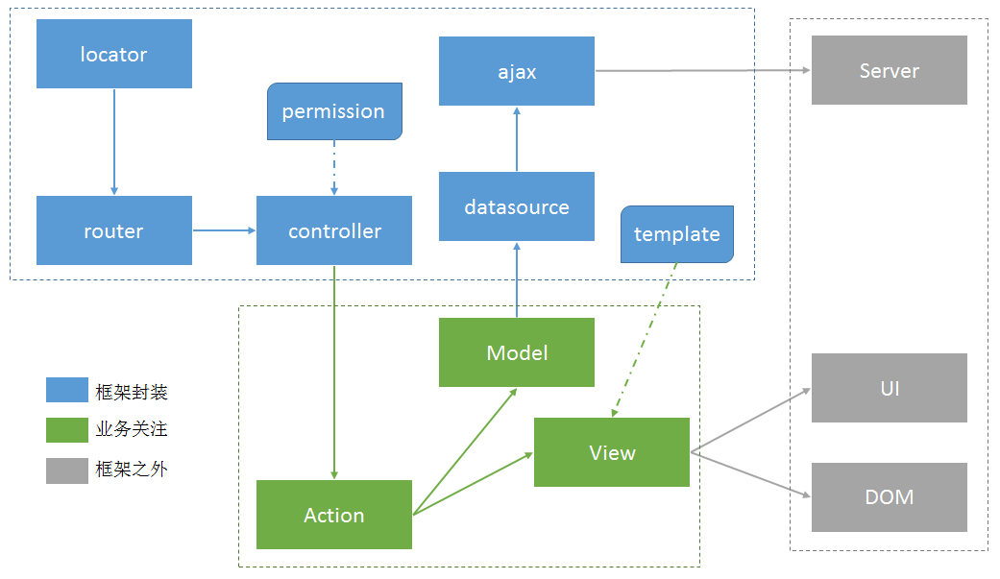

# ER(Enterprise RIA) Framework

ER 是一个富浏览器端web应用的框架，适用于并能很方便地构建一个整站式的AJAX web应用。

ER具有如下特性：

- 通过hash实现路径的管理，支持浏览器的前进和后退功能，以及URL的可访问性。
- 提供精简、核心的Action、Model和View的抽象，使得构建RIA应用变得简单可行。
- 提供可配置式的数据加载方案，提供灵活且完善的数据获取功能。
- 提供支持基本逻辑和数据绑定的模板引擎，提供模板嵌套和母板页。
- 不依赖任何第三方库，模块精简、可切分及独立运行。

ER的目的在于让业务开发工程师可以关注于 **数据（Model）** 、 **业务（Action）** 和 **视图（View）** 这三部分，而不需要关心如 **数据怎么获取** 、 **权限如何管理** 、 **URL如何控制** 等技术性问题。

## 文档

    cd {esui}
    sudo gem install jsduck
    jsduck —-config=jsduck/config.json
    open doc/api/index.html
