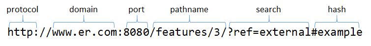

# locator对象

locator对象是框架逻辑的起点，用于实现针对URL的导航，管理历史记录以实现前进、后退等功能。

一个标准的URL串的结构如下：

在er框架中，导航由其中的 **hash** 部分实现。locator的职责如下：

- 监听hash部分的变化，当发生变化时，触发相应事件。
- 提供方法修改hash部分的值。

## 方法

### start方法

`start`方法指定locator对象开始工作。

如果一个系统同时使用locator、router和controller对象，则其启动顺序应当是 **controller -> router -> locator** 。

### redirect方法

`redirect`方法用于跳转到指定的URL，其签名如下：

    redirect({string} url, {Object=} options)

#### 参数

- `{string|URL} url`：重定向的地址
- `{Object=} options`：额外附加的参数对象

其中`options`参数可包含以下属性：

- `{boolean} fource`：当该值为 **true** 时，假设给定的 **url** 与当前的地址相同，也会强制刷新从而触发 **redirect** 事件。

### reload方法

`reload`方法用于强制刷新当前的地址，其等效于以下代码：

    redirect(url, { force: true });

### 事件

### redirect事件

当**hash**值发生变化，或由于`redirect`方法的调用传递了`force`选项导致刷新时，会触发该事件。

#### 事件属性

- `{string} url`：当前的hash值，对框架使用者而言，可以你认为这个值即是一个URL。

## 设计理念

作为一个框架的起点，除一些工具库以及信息封装类外，不应该依赖任何其它组件，以避免产生循环式的依赖。因此locator对象是非常独立的一个对象，对于er框架而言，可以只使用其中的locator对象，便能完成一些简单的逻辑和业务。可以参考[使用locator对象制作标签页切换功能](../../example/tab "展示单独使用locator对象")更深入地了解locator对象如何独立运作。

其次，er框架的起点是针对URL的处理，因此locator作为承载这一功能的对象，应当保持职责的单一，因此locator对象在设计上只提供了非常简单的接口，以避免框架的重量化。